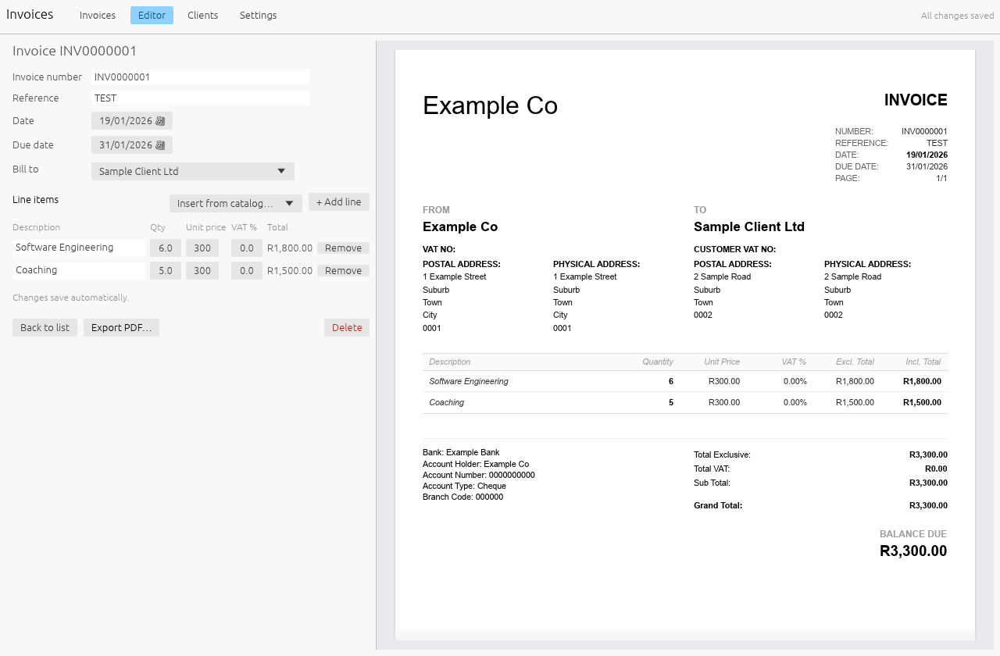

# Invoices

A small Windows desktop app for making clean, printable A4 invoices. It is a
native Rust app built
with [egui](https://github.com/emilk/egui), with no browser or web server. Your
invoices, clients and settings are stored in a **SQLite** database on your PC.



---

## Installing it on your PC

### 1. Get the installer

There is no download link yet, so you build the installer once on a computer
with the developer tools (it can be the same PC). See
[Building the installer](#building-the-installer) below. You end up with:

| File | What it is |
|---|---|
| `dist\Invoices-0.1.0-x64.msi` | The installer. Use this. |
| `dist\Invoices-0.1.0-x64-portable.zip` | The same app with no installer. Unzip anywhere and run `invoices.exe`. |

Copy the `.msi` to the PC you want to use (USB stick, OneDrive, email, …).

### 2. Run the installer

1. Double-click `Invoices-0.1.0-x64.msi`.
2. Windows SmartScreen may say *"Windows protected your PC"*. The installer
   isn't code-signed, so Windows doesn't recognise it. Click **More info →
   Run anyway**.
3. Approve the administrator prompt. The installer has no further questions.

That's it. Invoices is installed in `C:\Program Files\Invoices`, with shortcuts
in the **Start menu** and on the **desktop**.

Nothing else is needed: SQLite and the C runtime are built into
`invoices.exe`, so there is no database server, Visual C++ redistributable or
browser to install. Windows 10 or 11 (64-bit) is required.

### 3. First start

Open **Invoices** from the Start menu. On first start it creates an empty
database (see below). Then:

- **Settings**: fill in your company details, logo, banking details and
  invoice numbering, plus any catalog items you bill often.
- **Clients**: add the people/companies you invoice.
- **Invoices → + New invoice**: fill in the form on the left. The printable
  invoice on the right updates as you type. **Export PDF…** saves it and opens
  it in your PDF viewer.

Everything saves automatically. There is no Save button.

If you already have invoices in the old browser version, bring them across
first: see [Moving your existing data in](#moving-your-existing-data-in).

---

## Your data: the SQLite database

All your invoices, clients, catalog items and settings live in **one file**:

```
%APPDATA%\Invoices\invoices.db
```

That is usually `C:\Users\<your name>\AppData\Roaming\Invoices\invoices.db`.
The app shows the exact path under **Settings → Data**, with an **Open
folder** button.

Things worth knowing:

- **It belongs to your Windows user.** Each Windows user on the PC gets their
  own database.
- **Uninstalling or upgrading never deletes it.** The installer only manages
  the program in `C:\Program Files\Invoices`, never the database. To remove
  your data completely, delete the `%APPDATA%\Invoices` folder yourself.
- **Back it up.** Use **Settings → Back up database…** to save a complete copy
  (for example `invoices-backup-2026-10-08.db`) to a USB stick or OneDrive.
  This is safe while the app is open. Alternatively, close the app and copy
  `invoices.db` itself.
- **Restoring a backup:** close Invoices, rename the backup to `invoices.db`,
  put it in `%APPDATA%\Invoices` (replacing the current file), and start
  Invoices again.
- **Moving to a new PC:** install Invoices there, then copy your
  `invoices.db` into `%APPDATA%\Invoices` on the new PC (the same steps as
  restoring).
- **Using a different location:** set the environment variable `INVOICE_DB`
  to a full file path (for example `D:\Documents\invoices.db`) and the app
  will use that instead. Don't put the database in a synced folder that two
  PCs open at the same time: SQLite expects one PC to have it open at a time.
- **Looking inside:** it's a normal SQLite file, so tools like
  [DB Browser for SQLite](https://sqlitebrowser.org/) can open it. Back it up
  first if you plan to edit it there.
- **Plain-text export:** **Settings → Export data.json…** writes everything
  as JSON (the same format the old browser version used). **Import
  data.json…** replaces all data with such a file.

The tables are `company`, `settings`, `clients`, `catalog_items`, `invoices`
and `line_items`. The schema is in [src/db.rs](src/db.rs).

---

## Moving your existing data in

The old browser version kept its data inside the web browser, so first get it
out as a file: open the old version in the browser you used before and go to
**Settings → Export data.json**. If you had connected a `data.json` file
there, you can use that file directly.

Then load it into the desktop app, either way:

- **In the app:** **Settings → Import data.json…** and pick the file. This
  replaces everything in the database, so use it on a fresh install (or
  after a backup).
- **With the import tool:** close Invoices, then double-click
  `invoices-import.exe` (in `C:\Program Files\Invoices`, or in the portable
  folder). It asks for the `data.json`, asks before replacing any existing
  data, and shows what it imported, with each invoice's total so you can
  check them against your PDFs.

  Before replacing anything it saves a copy of the current database as
  `invoices-before-import-<date>.db` in `%APPDATA%\Invoices`.

  It also works from a command prompt:

  ```bash
  "C:\Program Files\Invoices\invoices-import.exe" C:\path\to\data.json
  ```

  From a command prompt it refuses to replace existing data unless you add
  `--force`. Use `--db <file>` to write somewhere else.

---

## Updating to a new version

Bump `version` in [Cargo.toml](Cargo.toml), build the installer again and run
the new `.msi`. It replaces the old program and leaves your database alone.

## Uninstalling

**Windows Settings → Apps → Installed apps → Invoices → Uninstall.** Your
database stays in `%APPDATA%\Invoices` (see above).

---

## Building the installer

One-time setup on the build PC:

1. **Rust:** install from <https://rustup.rs> (accept the default MSVC
   toolchain). If it asks for the *Visual Studio C++ Build Tools*, install
   them with the "Desktop development with C++" workload. They are needed to
   compile SQLite.
2. **.NET SDK** (8 or newer): <https://dotnet.microsoft.com/download>.
3. **WiX Toolset v5**, the installer builder:

   ```bash
   dotnet tool install --global wix --version 5.0.2
   ```

Then, from this folder:

```bash
powershell -ExecutionPolicy Bypass -File packaging\windows\package.ps1
```

The first build takes a few minutes. The `.msi` and the portable `.zip` end up
in `dist\`. Add `-SkipBuild` to repackage without recompiling.

---

## Development

```bash
cargo run
```

Runs the app. Set `INVOICE_DB` to use a scratch database instead of your
real one.

```bash
cargo test
```

Tests the totals, the database, the PDF output and the import. It also drives
the real UI offscreen and saves screenshots of every screen to
`target\ui-screens\`.

| Path | Purpose |
|---|---|
| `src/main.rs` | Starts the app and opens the database |
| `src/app/` | The UI: invoice list, editor + live preview, clients, settings |
| `src/layout.rs` | The printed invoice layout, shared by the preview and the PDF |
| `src/pdf.rs` | PDF export (krilla) |
| `src/db.rs` | SQLite schema and queries |
| `src/model.rs` | Data types, totals, money formatting |
| `src/paths.rs` | Where the database lives |
| `src/bin/import.rs` | `invoices-import.exe`: loads a `data.json` |
| `packaging/windows/` | Installer definition (`invoices.wxs`), build script, icon generator |
| `assets/` | App icon |
| `tests/fixtures/sample-data.json` | Made-up sample data used by the tests |

### Numbers

Each line: `Excl. Total = Qty × Unit Price`,
`Incl. Total = Excl. Total × (1 + VAT%)`. The invoice totals are the sums of
the lines. These rules are in
[src/model.rs](src/model.rs).

The invoice uses Arial from Windows' fonts folder, the font of the original
invoice.
